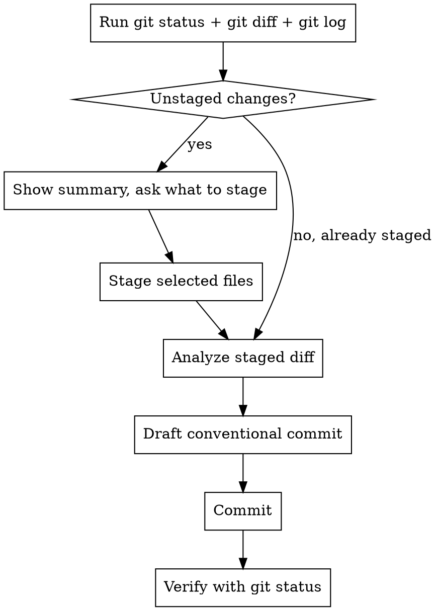

# Commit

Stage and commit changes with a conventional commit message derived from the actual diff.

This repo **enforces** Conventional Commits via `commitlint`
(`@commitlint/config-conventional`) on the `commit-msg` hook, and runs
`lint-staged` on `pre-commit`. A guided interactive alternative exists —
`pnpm tool::commit` (commitizen) — but this command drafts the message directly
from the diff.

## Workflow



### Step 1: Gather context

Run these in parallel:

- `git status` — see staged vs unstaged vs untracked
- `git diff` — unstaged changes
- `git diff --cached` — already-staged changes
- `git log --oneline -5` — recent commit style reference

### Step 2: Stage files

- If there are already staged changes and no unstaged changes, skip to Step 3.
- If there are unstaged/untracked changes, present a summary table of changed files with a short description of what changed in each, then ask the user what to stage.
- Stage specific files by name (`git add <file>`). Never use `git add -A` or `git add .` unless the user explicitly asks.

### Step 3: Analyze staged diff

Read the full staged diff (`git diff --cached`). Understand:

- **What** changed (files, functions, logic)
- **Why** it changed (feature, fix, refactor, chore, etc.)
- **Scope** (which section/component/area is affected)

### Step 4: Draft conventional commit message

Format:

```
<type>(<scope>): <subject>

<body>
```

**Type** — pick the most accurate:

| Type       | When                                                    |
| ---------- | ------------------------------------------------------- |
| `feat`     | New feature or capability                               |
| `fix`      | Bug fix                                                 |
| `refactor` | Code change that neither fixes a bug nor adds a feature |
| `chore`    | Tooling, deps, config, release                          |
| `build`    | Build system or external dependencies                   |
| `ci`       | CI/CD pipeline changes (`.github/workflows/`)           |
| `test`     | Adding or fixing tests                                  |
| `docs`     | Documentation only (`CLAUDE.md`, `README`)              |
| `style`    | Formatting, whitespace (no logic change)                |
| `perf`     | Performance improvement                                 |

**Scope** — this is a single-package, single-page personal profile site, so
derive scope from the affected area rather than a workspace package:

- **Section** when a single section changed: `hero`, `about`, `experience`,
  `projects`, `skills`, `contact`.
- **Shared component** when a component in `src/components/` changed: `nav`,
  `chip`, `section-heading`, `skip-link`, `glow-background`, `social-links`.
- **Feature area** when more specific: `data` (content in `src/data/`), `motion`
  (GSAP setup in `src/lib/gsap.ts` / scroll animations), `styles`
  (`src/styles/` tokens/mixins or `*.module.scss`), `ssg` (vite-react-ssg
  entry / prerender), `a11y` (accessibility fixes).
- **Tooling area** for non-app changes: `deps`, `ci`, `config`, `cspell`,
  `eslint`, `stylelint`, `firebase`, `deploy`.
- Omit scope only if the change is truly cross-cutting.

Match the style of recent history (`feat:`, `fix(a11y):`, `fix(ci):`,
`chore:`, `docs:`).

**Subject** — imperative mood, lowercase, no period. Keep the whole header
(`type(scope): subject`) well under commitlint's 100-char limit; aim for ~70.

**Body** — include ONLY when the subject alone is insufficient:

- Multi-file changes that need explanation of what was done
- Non-obvious reasoning (why this approach)
- Breaking changes

Omit the body for single-purpose, self-explanatory changes.

### Step 5: Commit

Use HEREDOC format for the commit message:

```bash
git commit -m "$(cat <<'EOF'
type(scope): subject line

Optional body explaining why.
EOF
)"
```

### Step 6: Verify

Run `git status` after commit to confirm success.

**Pre-commit hook behavior** — `lint-staged` runs on staged files:

- `*.{ts,tsx}` → `eslint --fix` then `prettier --write`
- `*.{css,scss}` → `prettier --write` then `stylelint --fix --quiet`
- `*.{html,js,json,md}` → `prettier --write`
- `*` → `secretlint`

Because the ESLint/Prettier/Stylelint steps **auto-fix in place**, a hook run may
modify your staged files. If the commit fails (e.g. an un-auto-fixable ESLint
error, or `secretlint` flagging a secret), fix the issue, **re-stage the affected
files**, and create a NEW commit. Then `commitlint` validates the message on
`commit-msg` — if it rejects the header, reword and commit again.

## Rules

- **Never amend** unless explicitly asked — always create new commits.
- **Never push** unless explicitly asked.
- **Never skip hooks** (`--no-verify`) unless explicitly asked.
- **Never stage secrets** (`.env`, `.env.local`, credentials, Firebase tokens).
  Warn the user if they request it — `secretlint` will block it anyway.
- **Never commit if nothing is staged** — no empty commits.
- If the commit fails due to a pre-commit hook, fix the issue, re-stage, and create a NEW commit.
